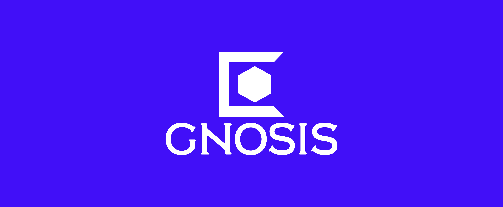

<div align="center">



# Gnosis
### University Management System


</div>

---

## 📖 Overview

**Gnosis** is a comprehensive, web-based platform designed to bridge the gap between students, professors, and university administration. Built with the power of **Blazor** and **.NET 8**, it facilitates seamless academic management, real-time communication, and efficient resource sharing in a modern, responsive environment.

## 🚀 Features

The system is compartmentalized into three distinct portals to ensure security and ease of use:

### 🎓 Student Portal
* **Academic Dashboard**: Real-time view of enrolled courses, pending exercises, and grade history.
* **Communication Hub**: Participate in course forums and exchange private messages with instructors.
* **Campus Utilities**: Access the daily cafeteria menu and view official university announcements.
* **Profile Control**: Manage personal contact details and account settings.

### 👨‍🏫 Professor Portal
* **Course Command**: Create curriculums, manage enrollments, and upload assignments.
* **Grading System**: A streamlined interface for inputting and modifying student grades.
* **Direct Engagement**: Post course-wide announcements and answer student queries directly.
* **Professional Profile**: Maintain academic credentials and public contact info.

### 🛠 Admin Portal
* **User Management**: Full control over student and professor accounts (CRUD operations).
* **Curriculum Administration**: Oversee the creation, updating, and deletion of courses.
* **System Oversight**: Generate reports, configure global settings, and update university metadata.
* **Moderation**: Monitor forums and messages to ensure community guidelines.

## 💻 Technology Stack

| Component | Technology | Description |
| :--- | :--- | :--- |
| **Framework** | .NET 8 | Blazor Web App (Server/Interactive) |
| **Language** | C# | Core backend logic |
| **Database** | SQLite | Lightweight, file-based database (`thesis.db`) |
| **ORM** | EF Core | Entity Framework for data access |
| **Auth** | Custom | Custom `AuthenticationStateProvider` implementation |
| **Styling** | Bootstrap | Responsive UI framework + Custom CSS |

## 📂 Project Structure

```text
├── Components/
│   ├── Data/           # Database Context (AppDbContext)
│   ├── Layout/         # Shared layouts (NavMenu, MainLayout)
│   ├── Models/         # Data entities (User, Course, Grade, etc.)
│   ├── Pages/          # Razor components (Admin, Professor, Student)
│   └── Services/       # Business logic (AuthService, GradeService)
├── wwwroot/            # Static assets (CSS, Images, Logos)
├── appsettings.json    # DB Strings and Config
├── Program.cs          # Dependency Injection & Middleware
└── thesis.db           # SQLite Database
```

## 🛠 Getting Started
Follow these steps to get a local copy up and running.

## Prerequisites
1.  .NET 8.0 SDK or later.
2.  An IDE like Visual Studio 2022 or VS Code.

## Installation
Clone the repository
```Bash
git clone [https://github.com/yourusername/thesis.git](https://github.com/yourusername/thesis.git)
cd thesis
```
## Database Setup
The project uses SQLite. The connection string in appsettings.json is pre-configured to look for thesis.db in the root directory.
Optional: If you need to regenerate the database schema:
```Bash
dotnet ef database update
```
## Run the Application
```Bash
dotnet watch
```
The application will typically launch at https://localhost:7197 or http://localhost:5283. Check Properties/launchSettings.json for specific ports.

## 🔐 Accounts
To access the different portals, you will need users with specific roles (Student, Professor, Admin) in the database.
Note: Refer to the Users table in thesis.db for credentials or use the Registration page (if enabled) to create a new user.

## 📜 License
This project is created for academic purposes.

<div align="center"> Developed by <strong>Andreas Kandilas</strong> </div>
